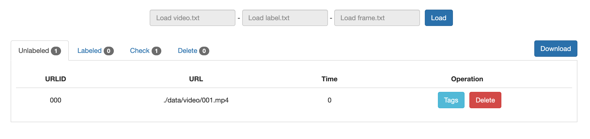
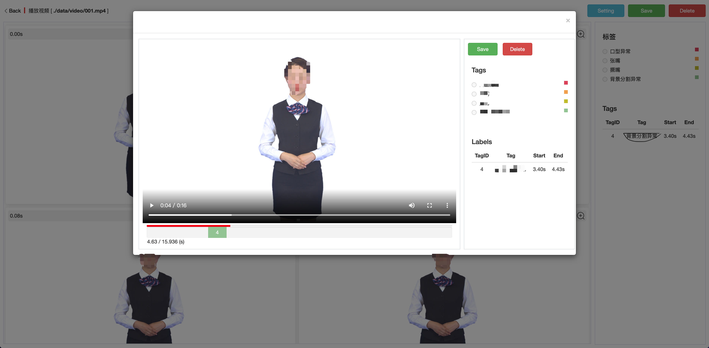
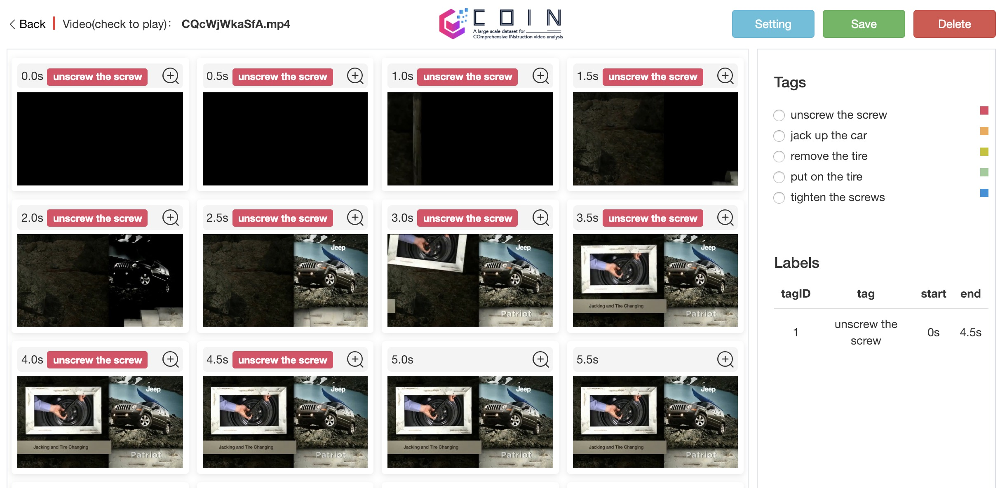

# Video Labeling

Based on [annotation-tool](https://github.com/coin-dataset/annotation-tool)

### step 1
Prepare labels :`./data/label.txt`

### step 2
Copy mp4 files into: `./data/video` dir

### step 3
Make txt files: python make_input.py (need ffmpeg)

### step 4
Chrome open: coin_annotation_tool.html

### step 5
Import 3 txt file in webpage:
`video.txt 、label.txt 、frame.txt`

